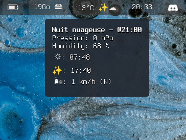

# WeatherBar
Weatherbar is a custom-module for [Waybar](https://github.com/Alexays/Waybar) to see weather information.



See the manual page of [Waybar custom-module(5)](https://man.archlinux.org/man/community/waybar/waybar-custom.5.en) for more information about custom-module.

# Download
`git clone https://github.com/ownesis/weatherbar`

# Compile
`cd weatherbar`
`mkdir build && cd build/`
`cmake .. && make`

# Install
`sudo cp weatherbar /usr/local/bin/`

# Configuration
The customization/configuration of weatherbar is almost the same of Waybar.

The configuration is done with a json file and you can use the same format of Waybar `{like_this}` for replace a format by a specific value.

The configuration file have `4` keys:

 - `"text"`: String value, *is the format to print in your bar (see `format` in `waybar-custom(5) man page`)* 
 - `"tooltip"`: String value, *is the format for tooltip (when your mouse hover the module (see `tooltip` in waybar-custom(5) man page)*
 - `"weather"`: Dictionnary, *This key have more key/value options related to the possible weather condition*. (see [example\_config.json](example_config.json)); A condition have two keys:
    - `"icon"`: String value, *It's the icon for this weather condition*.
    - `"text"`: Srtring value, *It's a custom text/information about this weather condition.*
 - `"city"`: String value, *It's the city to use for get weather. The value can be `""` for use the city found with your IP address.*

# Available format
 - `{city}`: The city.
 - `{counry}`: The country.
 - `{latitude}`: The latitude.
 - `{longitude}`: The longitude.
 - `{elevation}`: The altitude.
 - `{sunrise}`: The Sunrise.
 - `{sunset}`: The Sunset.
 - `{date}`: The date of the weather forecast.
 - `{hour}`: The hour of the weather forecast.
 - `{wind_speed}`: The speed of the wind.
 - `{wind_dir}`: The direction of the wind: (N, O, E, S, NO, NE, SE, SO) O == W(est).
 - `{wind_gust}`: The wind gust.
 - `{condition}`: The "friendly readable" weather condition (in French).
 - `{condition_key}`: The key of the weather condition (in French).
 - `{temp}`: The temperature in Celcius.
 - `{humidity}`: The percentage of humidity.
 - `{pressure}`: The pressure in hPa.
 - `{weather.icon}`: The Icon of the actual weather condition. (see [Customization/Configuration](README.md#Configuration)).
 - `{weather.text}`: The custom test of the actual weather condition (see [Customization/Configuration](README.md#Configuration)).

# Add to waybar
Add this "block" in your Waybar configuration file:

```json
  "custom/weather": {
    "format": "{}",
    "return-type": "json",
    "exec": "weatherbar /path/to/weatherbar_conf.json",
    "interval": 1800
  },
```

Don't forget to add `custom/meteo` inside the array "module-right", "module-center" or "module-left" into the waybar configuration and to add a css class inside `style.css`, the name of the CSS class is "custom-weather" (for our example above). 
